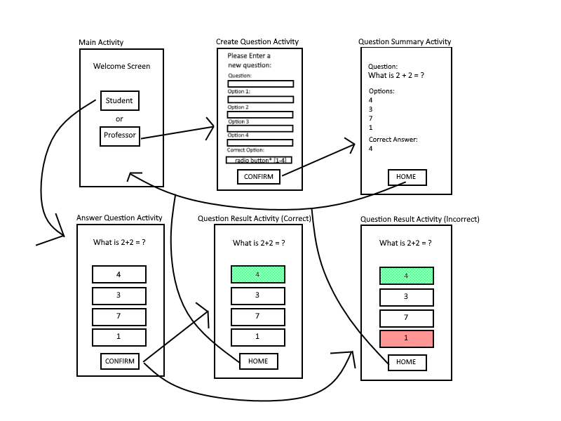

# COSC 310 - Software Engineering
## **Group JBAD - iClicker Clone**
## **Milestone #4**

**Team members:** Jesse Lazzari, Bhavya Bhagchandani, Arsh Bhat, Darion Pescada

**Milestone #4 – Testing/R&R Report/Release #1 (March 26th) (10%)**

**Project Milestone Goals Summary:**

For the development of our standalone application, testing, and pushing our first release, our team will be adopting the Agile Scrum methodology. As outlined in Milestone 3, we will be creating a simple standalone iClicker clone application using Android Studio, which will use the Android Studio component panel for client UI, and Java to handle functionality which will write to .txt files by using read and write file input/output stream to function as our "database". Since the goal is to create a standalone application for our presentation. 

**Agile Scrum Roles:**
- The Scrum Master: Jesse Lazzari
- Product Owner: Darion Pescada
- Delivery Team: All team members

**Daily Standups:**
- During our first daily standup for this sprint, we discussed the requirement and any obstacles that need to be faced in order to develop this first release, during this standup is when we outlined what needed to be added to this M4 README as well. Additionally, our team is using discord as a communication tool to share status updates, and new ideas for the project. Since the time frame for this release is quite short, we have also determined which features to develop for this first iteration. 
- On day three, during our daily standup our team discussed which features would be most important to implement and discussed our application views paper prototype. This diagram was later designed by scrum master Jesse, and product owner Darion, and will be used in order to create the first iteration of our UI for the i-Clicker Clone. 
- For this daily standup, only scrum master Jesse and product owner Darion were able to attend. We discussed key features to design, implement, and our approach to coding the application. 

**Agile Scrum Sprint Cycle:**

Normally, within Agile Scrum the sprint cycle is 2-4 weeks long however our team needs to speed up in order to be able to meet the March 26th deadline, thus our sprint cycle needed to be cut short to 3 days. The goal of this sprint is to produce a shippable product increment, that is a working release of our app.

# i-Clicker Clone Paper Prototype:

# Summary Dashboard

## 1. Highlight what tasks were done during this cycle (by owner)

| Task                                                      | Fully implemented (Yes/No) | Unit Tested | Contributor(s)      |
|-----------------------------------------------------------|-----------------------------|-------------|---------------------|
| Created Milestone 4 summary, role assignment and Summary dashboard | Yes | N/A         | Jesse and Darion    |
| Designed UI interface paper prototype                      | Yes | Yes         | Jesse and Darion    |
| Tested and reviewed paper prototype                        | Yes | Yes         | Bhavya and Arsh     |
| Improved original paper prototype and digitized            | Yes | Yes         | Jesse               |
| Created new Android Studio project                         | Yes | No          | Darion              |
| Designed Main Activity in android studio                   | Yes | Instrumental tests written by Bhavya and Arsh | Jesse and Darion |
| Designed Create Question Activity in android studio         | Yes | Instrumental tests written by Bhavya and Arsh | Jesse and Darion |
| Designed Question Summary Activity in android studio        | Yes | Instrumental tests written by Bhavya and Arsh | Jesse and Darion |
| Designed Answer Question Activity in android studio         | Yes | Instrumental tests written by Bhavya and Arsh | Jesse and Darion |
| Designed Question Result Activity                           | Yes | N/A         | Jesse and Darion    |
| Coded Student or Professor feature for Main Activity Screen (login will be added in future release) | No | Instrumental tests written by Bhavya and Arsh | Darion |
| Added button functionality to navigate between activities   | Yes | Yes         | Darion              |
| Added functionality for Create question view, and question summary view | Yes | No | Jesse               |
| Added error checking and ensured user control and flow (unable to continue without adding all new question text fields) | Yes | Yes | Darion |
| Added String bundles functionality to pass values between views | Yes | No | Jesse |
| Text file buffered writer implementation for standalone app implementation | Yes | No | Jesse |
| File input/output implementation                             | Yes | No | Darion |
| Programmed correct answer functionality for basic 1 question quiz (Multi question functionality will be added in next release using existing .txt file database) | Yes | Yes | Jesse and Darion |
| Added outline and unit tests for Login/Logout functionality for next release | No | Login/logout features written by Bhavya and Arsh | Bhavya and Arsh |

## 2. Summary of the progress

With this first release, we focused on ensuring that the main functionality of our app was present. That is, ensuring that the standalone app is functional for both the student and professor view and the ability to demonstrate from start to finish the following user scenario:

**User scenario:**
- Professor view:
  - Professor selects Professor option from home screen
  - Professor enters all fields in Create Question Activity
  - New question is written to text file database and saved locally
  - Question, answers and correct selection is shown on question summary activity
- Student View:
  - Student selects Student option from home screen
  - Student is presented with same question that professor had entered previously, which was pulled from text file database
  - Student makes 1 selection from A, B, C, D, E and confirms selection
  - Student answer is compared to correct selection from database and provided with proper visual color feedback depending on if their answer was correct

We decided to focus on this functionality first for this release, since the ability to read and write device inputs to a text file database will ensure that we can easily implement a multi question quiz for our second release. The ability to select between either the Student or Professor view will allow us to implement a login/logout feature in our next release as well.

## 3. Comments on the process;  how is the process you selected as a team working?  Does anything need to change?

So far the process has been good, our team's main struggle is our commitments to other classes, full time jobs, and needing to prioritize studying for midterms in other classes before we were able to begin working on the project. Communication has been good, since we have a dedicated discord server and hold daily standups. As the scrum leader, I have also been ensuring that we stay ahead of deadlines. For our next release, Darion and I would like to see more contribution from the rest of the team however this is something we've talked about already. 

## 4.  If you have a release candidate (something that is working, even partially, make note of that (this could be on your master branch, or you might choose to branch from master onto a release branch. 

As we reach closer to our March 26th deadline, I can confirm that we have a functional version 1.0 release candidate that performs the entirety of the user scenario outlined above. At this moment in time with the current feature implementations we would be able to perform a full demonstration of the application as well. As I look ahead to our next deadline and sprint cycle, I am confident that we will be able to implement the remaining features such as login/logout and multi question quizzes as outlined in Milestone 3. 

