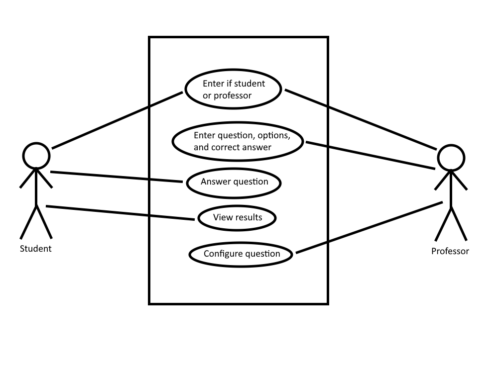

# **Group JBAD - iClicker Clone**

## Milestone 2

**Team members:** Jesse Lazzari, Bhavya Bhagchandani, Arsh Bhat, Darion Pescada

**Milestone #2 – Project Description and Requirements** (March 13th). A summary of “What”
your project is, who the users are, and “What” your project will do (functional, non-functional
requirements, etc) including use cases properly dressed with the appropriate level of abstraction.
Consider the tools (proto-personal, journey lines) (13%)

**Project Choice Description - iClicker Clone:**
This project involves the development of a web-based platform for classroom polling and
feedback. The platform should allow instructors to pose questions to students and receive instant
feedback. The platform should incorporate the Observer design pattern to notify the instructor of
student responses, and the Facade design pattern to simplify the interface between the user and
the underlying system. Additionally, the system should incorporate Continuous Integration and
Deployment (CI/CD) and automated testing and deploy quickly and without errors.

**Project Summary:**
New users can be of two types: admin and participant.
As an admin to the iClicker Clone, I want to be able to:
● Login/Logout as an admin
● Access my profile
● Setup a new object (class)
● Analyze polls through graphs such as pie charts, histograms etc.
● Create new question
● Add list of answer choices to question
● Choose the correct/desired answer
● Get each participant responses, and store them in a directory
As a participant to the iClicker Clone, I want to be able to:
● Login/Logout as a participant
● Access my profile
● Enroll into a new class session
● Participate in polls
● Select one of the choices
● Confirm final answer
● Access my marks through the directory lookup

**Primary User Profiles:**

Primary user 1 - Student:
Age: 21, Gender: Male,
Location: Kelowna, BC
Job title: Student
Work hours: full time student, ~40 hours a week
Income: $
Technology: Strong computer experience
Justification: This user is a full-time student at UBCO who uses our iClicker Clone as part of
their class participation

Primary User 2 - Professor:
Age: 20, Gender: Male,
Location: Kelowna, BC
Job title: Professor,
Work hours: full time professor, ~40 hours a week
Income: $100,000 per year
Technology: Strong computer experience
Justification: As a professor, this user takes advantage of our application to ask their students
questions and conduct polls in class.

**Functional Requirements:**
Prompt users to see whether they are a student or professor
Allow professors to create new questions, enter answer options, and the correct answer
Allow students to answer questions
Allow students to view whether they got the question correct or not
Allow professors to configure questions

**Non-Functional Requirements:**
The program shouldn’t disclose any personal information of users except their name and id to
admin and operators
The program should be accessible from any device and compatible with most browsers/OS
The program shouldn’t be time consuming or take more than 5 seconds to respond/lookup
The program development process and deliverable documents must conform to the process and
deliverables defined in the document ‘The Project’ on COSC 310 Canvas Page
The program code should be readable and well-tested
The program interface should be simple, clear, and up to basic user’s standards

**Use Case Diagram:**

**Use Case 1. Enter if Student or Professor**

Primary actor: Student, Professor
Description: The primary actor can login and specify what role they are
Precondition: User has opened application
Postcondition: User is logged into the system.
Main scenario:

1. User is asked to enter if they are a student or professor and login
2. Answer is stored in application
3. User is brought to main screen
Extensions:
1.1 User login does not exist
3.1.1 User is prompted to create an account

**Use Case 2. Enter Question, Options, and Correct Answer**

Primary actor: Professor
Description: The professor can add a new question with appropriate response options and the
correct answer.

Precondition: User has already logged in as a professor
Postcondition: User has successfully added a new question
Main scenario:

1. User selects option to add a new question
2. User is presented with text fields to specify each component of the new question
3. User saves new question
4. Question is stored and saved in the system
Extensions:
3.1 User does not fill out all appropriate fields
3.1.1 User is prompted to fill out all fields for the question

**Use Case 3. Answer Question**

Primary actor: Student
Description: The student user is prompted to answer a question and presented with 4 options
Precondition: User has already logged in as a student
Postcondition: User has successfully answered a question and is given feedback
Main scenario:

1. Student user is presented with a question and 4 possible answers
2. User selects 1 of the 4 answers
3. User confirms their final answer
4. User is given feedback on if their answer was correct
Extensions:
2.1 User changes their answer before submitting
2.2 User cannot think of a correct answer and leaves options blank

**Use Case 4. View Results**

Primary actor: Student
Description: The student user can view their total score for all questions answered
Precondition: User has already logged in as a student and answered question(s)
Postcondition: User has viewed their history and iClicker grade

1. User selected option from main screen to view their total score
2. User views total score and answer history
Extensions:
2.1 User has not answered any questions

**Use Case 5. Configure Question**

Primary actor: Professor
Description: The professor user can edit an existing question entry and configure its fields
Precondition: User has already entered a question into the system and would like to configure it
Postcondition: The user has successfully configured their question

1. The professor user selects the edit question option from the main screen
2. The user is presented a list of existing question entries
3. The user selected which specific question they would like to configure
4. The user edits the appropriate fields
5. The user confirms their new configuration and returns to the main screen
Extensions:
2.1 User has not added any questions
5.1 The user decides to edit another question before returning to the main screen

**Architectural Design Summary:**
For the architectural design we are going to perform following process:
1. Client UI: For client UI we will be designing using components of a GUI integrated software development program such as buttons, panels, radiogroups. It will be used to get user input and make it a more visual than plain Java. These components will incorporate multiple functionalities such as: select an option, a submit button, a panel for sessions available and open, a 'leave the session' button, labels as well as imageFields for questions
2. Application Server: This is the main body of the program. It handles all the logic and control flow in our software. It will consists of Java code which will take input from the user and perform tasks such as creating a sub directory for all the file operations or looking up from the existing main file directory, authenticate a user, recording datetime, exit operations, validation and so on
3. Database: For this tier, we will be mainly using the file operations of the platform, that forms a small storage compartment for our data storage and maintenance needs. This will act as a database and it will be used to read and write data that includes operations such as creating new/ looking up questions/polls/marks, user personal info
